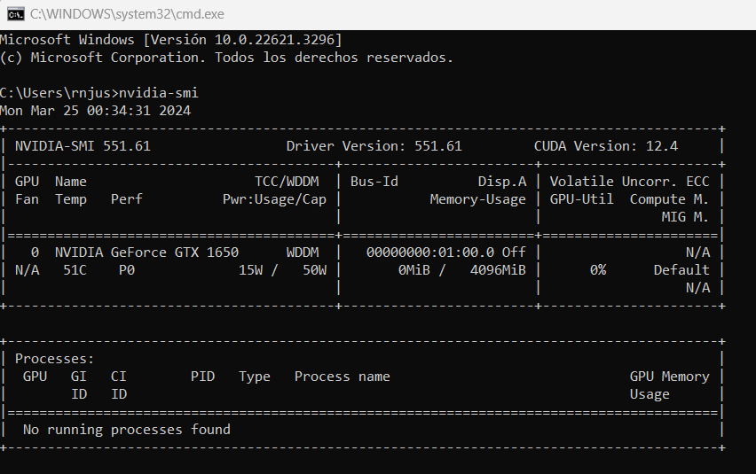
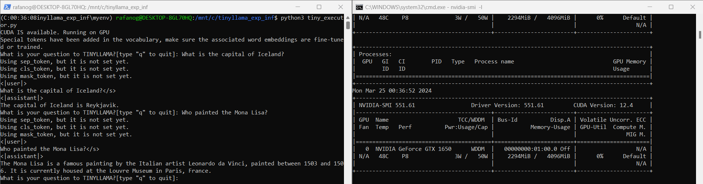

# TinyLLama Inference Experiment

Reworded the base chatbot script created [here](https://huggingface.co/TinyLlama/TinyLlama-1.1B-Chat-v1.0) with some
basic validations to make it a looping mini chatbot.

Includes: 
- Basic regex validation for questions.
- Verbose CUDA validation.
- Quit instruction.

To run it:
- Install nvidia driver.
- Install CUDA 12.3.1v or higher.
- Clone speechgpt repo and install dependencies from "requirements-diego.txt"
- Trigger tiny_executor.py

GPU before running:

Chatbot running and GPU showing activity:

## Experiments

In case, some experiments need to be executed, there's a script within the 
experiments folder(experimentor.py) that can be executed. Here's a brief segmented description on how it makes the experiments:
- There is a questions.txt file that includes a list of 100 randomized questions including a several variety of topics.
- There's a parameters.py file where parameters used to set up the execution are specified.
- Code is currently segmented in these main scripts:
  - requirements_validator.py: which contains validations of pre-requisites to execute the experiment as well, currently it only validates that the model is being executed in the GPU
  - model_interactor.py: contains the ModelInteractor class which has methods to interact with the model(asking questions, capturing answers, etc).
  - experimentor.py: script in charge of triggering the whole experiment(preparation and actual execution with the parameters and specifications in the other files)
  - reports.py: Saves a snapshot with the values and results of the experiment